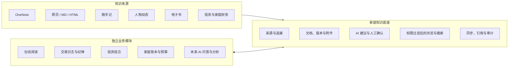

# 家庭知识底座架构决策与第一版验收标准

> 状态：已确认的产品与架构基线，作为第一版设计、开发和验收依据
>
> 更新日期：2026-08-05
>
> 适用项目：家庭工作台
>
> 关联文档：[家庭知识产品原则](family-knowledge-product-principles.md)、
> [系统架构基线](architecture-baseline.md)、[当前待办](pending-tasks.md)

## 1. 文档目的

本文件固化家庭知识底座目前已经确认的产品范围、模块边界、数据口径、关键架构决策和第一版
可执行验收标准，避免在开发过程中把“同步工具”“笔记软件”“阅读器”“财经资讯抓取”和
“AI 问答”混成一个难以维护的大模块。

长期产品定位、交互哲学和跨阶段决策原则见《家庭知识产品原则》；本文负责把这些原则落实为
架构决策、分期范围和可核查验收标准，不重复记录当前开发进度。

本文所称“知识底座”不是单一笔记编辑器，而是家庭工作台中统一承接知识来源、原文、附件、
结构化元数据、人工整理结果、检索索引和业务引用关系的基础设施。各业务模块继续拥有自己的
事实数据和操作流程，通过明确接口与知识底座连接。

## 2. 产品目标与原则

### 2.1 产品目标

家庭知识底座最终应当做到：

1. 家庭成员可以把分散在 OneNote、网页、Markdown、HTML、电子书及家庭工作台各业务模块中的
   内容安全保存到 NAS。
2. 内容保留来源和原文，可按成员、来源、主题、人物、时间和业务对象整理、浏览与搜索。
3. AI 可以提出摘要、标签、分类和关系建议，但不能决定内容是否进入知识库；成员的分区规则、
   明确勾选、批次确认或“保存为知识”操作构成人工选择。
4. 后续 AI 问答、专题研究、读书总结、交易复盘和家庭财务回顾可以引用同一套经过权限过滤且
   可追溯的知识。
5. 原始资料、家庭业务事实和 AI 派生结果能够区分，任何结论都可以回到具体来源和版本。

### 2.2 长期原则

- **NAS 是家庭知识的长期保存位置**：业务数据库保存元数据和关系，原文与附件保存在受控文件
  存储中，二者必须能够一起备份和恢复。
- **原文优先、AI 派生**：AI 摘要、标签、分类、关系和报告不能覆盖原文。
- **人对正式知识负责**：AI 结果默认是待确认建议，不能未经确认直接改变正式分类。
- **同步、知识去向与 AI 整理分开**：同步回答“是否取得原文”，来源规则回答“直接入库、待整理
  还是仅同步”，AI 状态回答“建议是否生成和核对”。三者不得合并成一个状态。
- **单向同步优先**：第一版从外部来源同步到 NAS，不从 NAS 反向修改 OneNote。
- **来源可追溯**：每项知识都记录来源、原始链接或外部 ID、作者、时间、同步批次和内容版本。
- **业务事实留在业务模块**：交易、持仓、估值、预算和支出等事实仍由对应模块管理，知识底座
  只建立受控引用、检索投影或不可变报告。
- **默认家庭协作，同时允许私密**：新同步内容默认家庭可见；成员可以在来源、笔记本或单项内容
  层面设为私密。现有私密数据不得因接入知识底座而被静默放宽权限。
- **先解决真实使用，再扩展智能功能**：第一版完成同步、整理、浏览和搜索，不实施 RAG 问答、
  自动投资建议或全面互联网抓取。

## 3. 已确认的知识来源

| 来源 | 长期接入方式 | 内容归属 | 第一版范围 |
| --- | --- | --- | --- |
| 家庭成员 OneNote | 每位成员分别绑定 Microsoft 账户；按分区直接入库、待整理或仅同步归档 | 外部原文完整接入 | 是；先用一位成员的一个笔记本验证 |
| 现有投资笔记/随手记 | 成员勾选“加入知识库”后建立内部引用和搜索投影 | 原模型仍为权威数据 | 是；默认不进入知识库 |
| 网络文章 | 保存正文、正文图片和原始链接，保留作者与发布时间 | 外部原文完整接入 | 架构支持；第一版不做通用网页采集器 |
| 经济学家财经日记 | 批量导入 Markdown，保留目录、文件和时间信息 | 外部原文完整接入 | 后续批量导入阶段 |
| 财经大 V 微信公众号文章 | 批量导入 HTML，保存净化后的正文、图片和来源信息 | 外部原文完整接入 | 后续批量导入阶段 |
| 关注人物与机构动态 | 独立多来源订阅、AI 摘要、关键词和事件聚合；成员按需保存为知识 | 人物模块拥有资讯流 | 后续动态追踪阶段 |
| 在线图书 | 阅读模块管理图书与阅读事实；获选笔记、划线、总结和思维导图按需发布 | 阅读模块拥有阅读事实 | 后续在线阅读模块 |
| 交易记录与交易纪律 | 交易事实引用、交易案例、纪律版本和复盘报告 | 投资组合与交易日志分域管理 | 后续交易日志模块 |
| 资产配置、预算和支出分析 | 由业务模块发布带数据口径的不可变知识报告 | 财务模块拥有事实与计算 | 后续按需发布 |
| 将来新增的家庭工作台模块 | 按“完整接入、内部引用、发布报告”三种模式之一接入 | 原业务模块保持权威 | 架构必须支持 |

## 4. 模块边界决策

### ADR-KB-001：采用“共享知识底座 + 独立业务模块”

不把知识库、阅读器、交易日志和财务分析做成一个万能模块，也不让各模块各自建立一套重复的
文件存储、标签、搜索和 AI 审计能力。

各业务模块共享以下基础能力：

- 家庭成员、可见范围和权限判断；
- 来源登记、原文版本、附件和内容哈希；
- 标签、人物、主题和跨文档关系；
- AI 建议、人工确认和操作审计；
- 统一搜索入口和结果引用；
- 任务状态、同步日志和失败重试；
- 受保护的文件访问、备份和恢复。

各业务模块仍独立拥有以下事实：

- 阅读模块：书籍版本、阅读计划、个人阅读进度、划线锚点、批注和评论；
- 交易日志模块：交易案例、交易前计划、交易纪律版本、执行偏差和复盘；
- 投资组合模块：交易流水、持仓、估值快照及其计算口径；
- 家庭账本模块：账户、预算、收支事实和财务计算；
- AI 分析服务：模型调用能力和调用审计，但不拥有业务结论本身。

### ADR-KB-002：模块化 Django 单体，不引入微服务

第一阶段继续使用当前 Django、PostgreSQL 和 NAS 文件存储。建议按领域逐步形成：

- `knowledge`：来源、文档、版本、附件、标签、关系、人工确认、搜索和任务记录；
- `knowledge.connectors`：OneNote、Markdown、HTML、动态来源和内部投影适配器；
- `reading`：在线阅读领域；
- `trading_journal`：交易日志和交易纪律领域；
- 现有 `notes`、`portfolio`、`ledger` 等应用继续保留业务所有权；
- 现有 AI 能力作为公共服务被领域调用，不成为通用数据仓库。

第一版不引入 Celery、Redis、独立消息队列、微服务或通用 EAV 模型。只有在 PostgreSQL 任务表
和 DSM 定时命令经实际使用证明不足时，再单独评估任务系统。

### ADR-KB-003：所有来源使用三种明确接入模式之一

1. **完整接入**：用于 OneNote、网页、Markdown、HTML 等外部内容。保存不可变原始内容、
   净化后的展示内容、附件、版本和来源链接。
2. **内部引用与搜索投影**：用于随手记、交易流水、阅读批注等已有业务数据。原业务记录是唯一
   可编辑事实，知识底座只保存可重建的索引和稳定引用。
3. **发布不可变知识报告**：用于资产配置、预算支出、交易复盘和 AI 总结。报告保存生成时的
   数据范围、截止时间、计算口径、来源引用和版本，底层数据变化时标记过期，不静默改写旧报告。

任何新模块接入前必须先选择以上一种模式，不能默认复制整张业务表，也不能把所有数据直接切分
后送入向量库。

### ADR-KB-004：原始层、规范层和派生层分离

每项完整接入内容分为：

- **原始层**：来源返回的原始正文或文件及原始附件，只追加新版本，不在线渲染、不被 AI 覆盖；
- **规范层**：经格式转换和安全净化后用于页面展示和全文搜索的统一内容；
- **派生层**：搜索索引、文本分块、AI 摘要、标签建议、人物关系和未来向量索引。

原始层和业务数据库属于必须备份的权威资料；规范层在保留转换版本的前提下可重建；搜索与向量
索引必须完全可重建。

### ADR-KB-005：技术同步、知识归属与 AI 整理状态分开

技术状态回答“有没有成功拿到内容”：

- 待运行、运行中、成功、部分成功、失败、来源不可访问。

知识状态回答“内容在知识中心中的去向”：

- 待整理、已入库、仅同步归档。

AI 整理状态回答“整理建议进行到哪里”：

- 收件箱、已规范化、待 AI 处理、待人工确认、已确认、已忽略、已归档。

三者不能合并成一个状态字段。例如已经入库的心得可以仍未生成 AI 摘要；生成新建议也不能让它
从知识库消失。页面面向成员主要显示“保存状态、知识状态、AI 整理进度”。

## 5. 核心概念与数据责任

第一版的数据模型应围绕以下稳定概念设计。具体表名可在实现时按现有项目风格调整，但不得改变
数据责任。

### 5.1 来源与账户

- **KnowledgeSource**：一个逻辑来源，如某 OneNote 笔记本、某批 Markdown 文件、随手记或
  某人物官方账号。
- **SourceConnection**：某个家庭成员对外部服务的授权连接。记录拥有者、授权状态、加密凭据
  引用、同步游标、最近成功时间和错误摘要。
- 同一个家庭可以有多个成员分别绑定各自的 Microsoft 账户；凭据和同步游标不能共用。
- 管理员可以查看连接状态和任务结果，但不能查看访问令牌。

### 5.2 文档、版本与附件

- **KnowledgeDocument**：稳定知识身份，保存来源、外部 ID、标题、作者、内容时间、可见范围、
  当前版本和整理状态。
- **KnowledgeRevision**：一次不可变内容版本，保存内容哈希、原始内容位置、规范正文、转换器
  版本和抓取时间。
- **KnowledgeAsset**：图片和附件，保存来源、文件哈希、MIME、大小、所属版本和受保护路径。
- 同一来源和外部 ID 必须幂等更新；内容哈希未变化时不得制造新版本。
- 来源内容被删除时默认保留 NAS 副本，并标记“来源已删除/不可访问”，不自动物理删除。

### 5.3 AI 建议与人工确认

- **KnowledgeProposal**：AI 针对某个精确内容版本提出的摘要、标签、分类、人物或关系建议。
- 每项建议记录内容哈希、模型、提示词版本、生成时间、成本或用量、状态、确认人和确认时间。
- 用户可以逐项接受、修改、拒绝，也可以在有预览和影响数量时批量接受。
- 原文出现新版本时，旧建议保留审计记录但自动失效，不能覆盖新内容上的人工结果。
- 人工编辑的正式摘要和分类不得被后续自动任务覆盖。

### 5.4 引用与关系

- **KnowledgeLink**：文档与人物、主题、书籍、交易、账户、分析报告及其他知识之间的带类型关系。
- 所有引用必须能定位到稳定业务对象或精确知识版本。
- 未来 AI 回答必须引用实际使用的文档版本，而不是只显示模糊的文档标题。

### 5.5 任务与审计

- **SyncRun/ImportRun**：记录任务类型、来源、发起人、开始结束时间、游标、成功/跳过/失败数量、
  错误明细和可重试状态。
- 每个内容项目应有可追踪结果；单项失败不能导致已成功项目回滚，也不能被总状态掩盖。
- 同一来源不能被两个任务并发同步；任务必须支持幂等重跑和失败续跑。

## 6. 各来源与业务模块的具体决策

### 6.1 OneNote

- 家庭成员各自绑定自己的 Microsoft 账户。
- 同步方向固定为 OneNote 到 NAS；第一版不回写标题、正文、标签或删除操作。
- 第一版只选择一位成员的一个笔记本进行正式验证，但数据模型、权限和页面必须支持其他成员
  后续自行绑定。
- 同步保留笔记本、分区、页面层级，原始页面内容、页面图片、正文中的原始网页超链接、
  OneNote 来源链接、创建时间和修改时间。
- 页面首次导入时，以所属 OneNote 分区作为可编辑的默认分类；现有分类为空的试点文档可以一次
  性补填。分区仍作为独立来源层级保存和展示，人工修改分类后后续同步不得覆盖；页面移动只更新
  原始位置，不静默改变人工整理结果。
- 首次全量后采用增量同步，并定期进行完整对账，以识别游标遗漏、来源删除或权限变化。
- 用户内容同步成功后立即可浏览；AI 处理失败不得阻塞同步结果。
- 每个已发现分区可配置“直接进入知识库、进入待整理、仅同步归档”，并有新分区默认规则；
  心得和经验适合直接入库，摘录和临时文字适合待整理。规则默认只影响以后首次同步的新页面，
  成员明确选择后才批量应用于已有内容。
- 页面后续同步只更新原文版本和来源位置，不静默覆盖成员已经调整的知识状态；AI 是否启用与
  是否入库相互独立。
- 断开账户时由成员选择“保留 NAS 副本”或“进入待删除状态”，不得直接级联物理删除。

### 6.2 网络文章、Markdown 和 HTML 历史资料

- 网络文章保存正文、正文图片和原始链接；不得只保存摘要，也不得把导航、广告和脚本当正文。
- Markdown 和 HTML 导入保留原文件、相对目录、文件名、正文图片和可解析的作者/日期信息。
- 导入前必须提供只读试算：文件数量、预计新增/更新/跳过、重复项、无法解析项、附件数量和空间
  估算；用户确认后再正式写入。
- 通过来源 ID、规范化 URL 和内容哈希进行多层去重，不只依赖标题。
- HTML 在展示前必须安全净化；原始 HTML 只作为受保护原件保存。
- 历史财经资料第一轮重点是完整、可追溯、可搜索，不要求一次自动提炼十年的主题关系。

### 6.3 关注人物与机构动态

- 为人物、机构、账号和来源建立显式登记表，区分官方原文、授权 API、采访原文、媒体转述和
  人工补录。
- 首批候选可以包括马斯克、黄仁勋、奥特曼、达里欧、Michael Burry、Cathie Wood、特朗普和
  伯克希尔等已确认关注对象，覆盖其 X 发帖、采访、演讲、公开发言、观点和重要动态；具体名单
  与每个人的可用来源在该阶段开始前单独确认。
- 关注人物页面是独立的多来源聚合订阅，不进入知识中心待整理；模块内提供已读、收藏、稍后阅读、
  AI 摘要、关键词和事件聚合。大部分资讯只服务及时阅读，不成为知识。
- 成员对高价值长文、完整访谈或重要观点点击“保存为知识”后，才把获选原文、人物身份、来源等级
  和原始链接固化到知识底座；可直接入库，也可选择先整理。
- 页面必须显示来源等级和原始链接，不能把媒体转述表现成人物原话。
- 不承诺“抓取整个互联网”；每一种来源必须单独确认技术可用性、授权条款、频率、稳定性和成本。
- 对 X、微信公众号、新闻站点等来源优先使用官方或授权接口；无法合法稳定保存全文时，只保存
  允许保存的元数据、短摘要和原始链接。
- 每日任务支持限流、退避、断点续跑、重复检测和来源停用，单一来源失败不影响其他来源。

### 6.4 现有投资笔记/随手记

- 现有记录继续以原模型为唯一可编辑事实，不迁移成重复正文。
- 随手记默认不进入知识中心，也不进入待整理。成员在新建或编辑时明确勾选“加入家庭知识库”后，
  才创建内部引用与搜索投影；取消勾选只删除可重建投影，不删除原笔记。
- 用户从知识结果页编辑时跳转或调用原模块的正式编辑流程。
- 原记录修改或删除后，索引按稳定 ID 更新；不得产生孤立副本。
- 现有私密笔记保持私密，不因知识底座“默认家庭可见”而改变权限。
- 后续可以把前端名称逐步调整为“随手记”，并增加投资、工作台改进、AI 提示、学习、生活、
  阅读和其他等领域分类，但第一版不强制批量重分类现有数据。

### 6.5 在线阅读

在线阅读作为独立模块建设，并与知识底座深度共享基础能力：

- 原始书籍文件、书目、版本和阅读事实由阅读模块管理；
- 书籍正文、全部划线和阅读行为不自动进入知识库；成员选择的笔记、划线、AI 重点总结、思维导图
  和获准共享的讨论可按权限发布到知识库；
- 阅读计划、完成度、最后阅读位置和多设备冲突不放入通用知识文档模型；
- 书籍、版本、文件三个概念分离，同名书籍的不同译本、版次和文件不可混为一份；
- 原始电子书不可变，转换结果可重建，文件哈希用于去重；
- 首批原生支持 EPUB 和 PDF；MOBI、AZW3、TXT、Markdown 可通过后续转换链路支持；不处理
  受 DRM 保护文件；
- EPUB 划线使用稳定章节/CFI 和文本上下文，PDF 使用页码、坐标和文本上下文，避免换设备或
  小版本变化后批注失联；
- AI 分开总结“书籍内容”“个人批注”和“家庭讨论”，不能混成无法分辨来源的一段总结。

### 6.6 交易日志、交易纪律与交易复盘

- 现有交易记录中的交易逻辑、信息来源、策略、情绪、退出条件和备注仍属于交易事实的一部分，
  保留在投资组合模块，并可在知识中心搜索和引用。
- 后续独立建设交易日志模块，用一个“交易案例”关联建仓、加仓、减仓、退出等多笔交易。
- 交易案例包括交易前论点、证据、仓位与风险计划、入场条件、失效条件、退出计划、实际情绪、
  实际结果、纪律遵守/偏离和复盘结论。
- 交易前计划保存提交时间和版本，事后不能无痕改写，避免用结果倒推理由。
- OneNote 中已有交易纪律先作为草稿导入，经人工确认后形成有生效时间和版本号的纪律文档。
- 知识底座负责统一查找纪律、案例、交易引用和复盘报告，不接管交易事实或持仓计算。

### 6.7 资产配置、预算和支出分析

- 资产配置分析由投资组合模块负责；预算和支出分析由家庭账本模块负责。
- 用户可以选择“保存为知识报告”，生成不可变、可引用、可评论的 `KnowledgeArtifact`。
- 报告至少记录成员或家庭范围、期间或截止日期、来源快照/记录引用、指标定义、计算/代码版本、
  本位币、价格与汇率日期、AI 模型和提示词版本、确认人。
- 底层业务数据更正时，旧报告保留并标记“数据已变化/报告可能过期”，不能静默改写成新结果。
- 私密支出不能通过家庭可见的汇总、AI 摘要或搜索片段泄露。

## 7. 同步与后台任务架构

### ADR-KB-006：网页只创建任务，长任务由管理命令执行

同步、批量导入、正文转换、附件下载、AI 处理和索引重建不得在普通 HTTP 请求内完成。网页提交
后只创建待运行任务并立即返回任务页。

第一版使用：

1. PostgreSQL 任务记录；
2. Django 管理命令领取任务；
3. 数据库锁防止重复领取和同来源并发；
4. DSM Task Scheduler 周期运行管理命令；
5. 页面显示进度、最近心跳、单项错误、重试和取消状态。

任务要求：

- 重复运行不制造重复文档、版本和附件；
- 支持来源级游标和分页；
- 网络错误使用有上限的重试和退避；
- 取消只在安全点生效，不留下半写入状态；
- 进程异常退出后，超时任务可被识别并安全恢复；
- 日常定时任务失败返回非零状态并保留日志；
- 管理员按钮只是手工触发入口，不能代替 NAS 正式定时任务。

## 8. 权限、隐私与内容安全

### 8.1 可见范围

- 新的 OneNote 同步来源默认家庭可见，成员可在授权或选择笔记本时改为私密。
- 第一版至少支持“仅自己”和“家庭可见”；未来公开分享必须另行设计，不复用家庭可见链接。
- 来源权限向文档、版本、附件、搜索分块、AI 请求、摘要、关系和报告传播。
- 家庭成员默认可以查看彼此的家庭可见内容；只有来源所有者或具备相应角色的成员可以修改来源、
  重跑同步或改变可见范围。
- 现有随手记继续遵守原有可见性，不执行静默批量放宽。
- 成员离开或账户删除时，必须提供资料转交、保留、导出和删除流程。

### 8.2 OAuth 与密钥

- 每名成员只授权自己的外部账户，采用最小权限范围。
- 访问令牌和刷新令牌必须加密保存；加密密钥来自生产环境配置，不提交仓库。
- 页面和日志不得显示令牌、密钥、完整授权响应或带敏感参数的 URL。
- 成员可以查看授权范围、最近使用时间并主动撤销或重新绑定。
- 管理员只看健康状态和错误摘要，不取得成员外部账户令牌。

### 8.3 不可信内容

OneNote HTML、网页、电子书、SVG、图片、压缩包和附件均按不可信输入处理：

- 原始 HTML 不直接渲染，规范层进行标签、属性、协议和嵌入内容白名单净化；
- 校验扩展名、声明 MIME 和文件魔数，服务器生成内部文件名；
- 对单文件大小、总任务大小、文件数量、解压倍率和嵌套层数设置上限；
- 阻止路径穿越、压缩炸弹、可执行文件、危险 SVG、脚本、事件属性和任意 iframe；
- 内容页面设置合适的 CSP，外部资源默认不在浏览器中自动加载；
- 从 URL 获取内容时只允许明确协议，限制重定向、超时和响应大小，并阻止回环、私网地址、
  NAS 管理地址和其他 SSRF 目标。

### 8.4 私有附件访问

私有正文图片、书籍和附件不能依赖公开 `/media/` URL。必须通过鉴权下载端点、短期签名 URL
或反向代理内部跳转，在返回文件前检查当前成员权限。电子书和大文件阅读需支持 Range 请求，
未授权直接访问返回 403 或 404。

### 8.5 AI 与提示注入

- 外部内容永远视为数据，不能通过正文中的指令获得发消息、改数据、调用工具或扩大权限的能力。
- AI 请求前先按当前成员权限筛选内容，不能先检索私密内容再在答案阶段隐藏。
- AI 输出必须带来源和精确版本引用；删除、转私密和撤权后，相关索引和缓存同步失效。
- 向云端 AI 发送家庭原文前，必须向来源所有者说明服务商、发送内容范围、保存政策和费用上限。
- 对书籍、付费文章、微信公众号和人物内容记录作者、来源、版权/授权状态和允许的展示方式；
  “仅存 NAS”不自动等于允许对外再发布或发送给第三方模型。

## 9. 搜索与未来 AI 能力

### ADR-KB-007：先做真实语料检索验证，再确定搜索引擎

第一版需要全文搜索，但不预先锁定 PostgreSQL、Meilisearch、OpenSearch 或向量数据库。开发前
使用不提交仓库的真实脱敏样本完成检索试验，至少覆盖：

- OneNote 页面、Markdown、HTML 和现有随手记；
- 中文分词、英文和数字混合、人物中英文别名、短语、标题权重；
- 来源、成员、时间、标签和可见范围筛选；
- 高亮片段、结果去重和原文跳转；
- 至少 30 条代表实际使用方式的“黄金查询”及预期结果。

选择标准依次为：权限正确、结果质量、运维复杂度、可备份恢复、性能和未来扩展。向量检索只能
作为可重建的派生索引，不能成为原文唯一保存位置。

### 9.1 第一版搜索范围

第一版搜索标题、规范正文、人工确认摘要、分类、标签、作者/人物、来源名称、来源分区路径和
成员明确加入知识库的随手记。默认知识库只搜索已入库内容，“全部资料”可额外检查待整理和仅
同步归档原文。搜索结果显示来源、原始位置、可见范围、内容时间、知识状态和命中片段。

### 9.2 第一版不实施的 AI 能力

第一版不实施：

- 跨全部知识的 RAG 问答；
- 自动投资建议或自动交易决策；
- 未经确认自动建立大规模知识图谱；
- 自动生成并发布家庭或个人财务结论；
- 让导入内容触发外部工具或业务写入。

但数据模型必须让未来问答能够引用精确文档版本、遵守权限，并区分原文、家庭成员观点和 AI
推断。

## 10. 前端信息架构

主导航新增一个“知识中心”，不为每一种来源增加顶级导航。知识中心内部建议包含：

- **首页工作台**：以“今天需要做什么”为主线，显示今日入库、待整理、AI 建议、同步异常、
  继续阅读和最近知识；上传与导入能力未落地前必须明确标记；
- **AI 人工确认**：原文与 AI 建议左右并排，逐项接受、修改或拒绝；整篇确认保留预览步骤，
  最后一项处理后自动进入下一篇；重复和忽略操作在状态与审计模型完成后开放；
- **知识库与全部资料**：知识库默认只显示已入库内容，不再拆成“我的知识”和“家庭知识”；
  全部资料额外显示待整理和仅同步归档原文。两种视图默认当前成员，可通过成员、类型、来源、
  人物、标签、日期和状态筛选；桌面端二级目录可在“按分类”和“按来源”之间切换；
- **待整理**：只放已经决定保留、但仍需提炼的 OneNote 摘录或手工资料；完成人工整理或处理完
  AI 建议后进入知识库；
- **关注人物**：独立的多来源聚合订阅、人物主页和时间线，必须区分本人发言、机构发布、采访
  原文、媒体转述和 AI 摘要；普通资讯不进入待整理，成员主动保存的重要内容才接入知识底座；
- **在线书库**：图书、阅读计划和继续阅读，由 `reading` 独立负责，后续阶段开放；
- **主题与标签**：按标签、主题和后续关系浏览；
- **来源与同步**：账户绑定、笔记本选择、同步进度、失败明细和重试；
- **统一搜索**：位于知识库，跨已接入且被成员选择的来源搜索，并能按来源、成员、时间和类型筛选。

页面关系固定为：首页负责行动提示，待整理负责需要提炼的资料，AI 建议确认负责核对建议，关注
人物和在线阅读负责各自领域流程，知识库负责长期知识目录和筛选；专业模块只在成员明确选择时
发布知识或建立投影，不复制业务事实。

页面设计借鉴成熟产品的长处，但按家庭工作台重新设计：

- 借鉴 Notion 的清晰导航和属性展示；
- 在关注人物等高频资讯模块借鉴 Readwise Reader 的 Feed/Library 降噪，不作为所有来源的流程；
- 借鉴 Obsidian 的关系和反向引用；
- 不复制其复杂编辑器、插件体系或面向个人本地文件的权限假设。

普通家庭成员必须能在网页完成自己的账户绑定、查看同步状态、浏览、搜索和确认，不把常用操作
只放在 Django 管理后台。移动端至少保证浏览、搜索、确认和继续阅读等核心操作可用。

## 11. 存储、备份与可恢复性

建议把存储逻辑区分为：

- 原始资料：OneNote 原文、网页/MD/HTML 原件、书籍和原始附件；
- 业务数据库：文档身份、版本、权限、标签、确认结果、引用和任务审计；
- 派生资料：净化结果、封面/缩略图、搜索索引、文本分块和未来向量索引。

必须满足：

- 原始资料和 PostgreSQL 备份属于同一个可核查恢复点；
- 备份清单记录数据库备份、文件范围、文件数、总大小和校验值；
- 定期执行抽样恢复和完整恢复演练，而不只检查“备份命令成功”；
- 派生索引可从数据库和原始资料重建；
- 有容量配额、磁盘余量告警、孤儿附件检查和大文件失败提示；
- 导出时提供可迁移的原文、附件、元数据和关系，不把家庭资料锁死在专有数据库中；
- 删除采用回收站和保留期，永久删除前再次确认并记录审计。

## 12. 交付分期

### 第一版：知识底座与单笔记本验证

- 知识中心基础页面；
- 每位家庭成员分别绑定 Microsoft 账户的能力；
- 一位成员、一个 OneNote 笔记本的正式同步验证；
- 原文、图片、层级、来源链接和版本保存；
- 同步任务、状态、重试、审计和来源断开；
- AI 摘要、标签和分类建议及人工确认；
- 随手记明确勾选后的统一浏览与搜索投影；
- OneNote 分区级直接入库、待整理和仅同步归档；
- 统一浏览、筛选和全文搜索；
- 私密与家庭可见、受保护附件和基础备份恢复验证。

### 第二版：历史资料批量导入

- 经济学家财经日记 Markdown 导入；
- 财经大 V 微信公众号 HTML 导入；
- 导入试算、重复识别、错误报告和批次回滚；
- 在大体量真实语料上调整搜索、分类和人物/主题组织。

### 第三版：人物与机构动态

- 人物、机构、官方账号和来源登记；
- 合法可用来源的定时同步；
- 多来源订阅、来源等级、AI 摘要、关键词、事件聚合和阅读状态；
- 成员对重要长文或观点执行“保存为知识”。

### 第四版：在线阅读

- EPUB/PDF 书架、阅读器、年度计划、进度；
- 划线、批注、共享评论及权限；
- 成员选择的划线、笔记、总结和思维导图按需发布到知识库；
- AI 总结和思维导图另行验收。

### 第五版及以后：交易日志、财务知识报告和 AI 问答

- 交易案例、交易纪律版本和复盘；
- 资产配置、预算和支出分析报告发布；
- 在权限、引用、评测和成本控制成熟后实施家庭知识问答。

以上交付分期是知识底座自身的路线，不代表自动启动原项目待办中的“第五阶段分析功能”。

## 13. 第一版验收标准

以下项目全部通过，第一版才可验收。单纯“页面能打开”“管理命令执行成功”或“AI 返回了文本”
均不等于通过。

### A. 成员、授权与来源

- [ ] **AC-KB-001** 普通家庭成员可以在网页绑定自己的 Microsoft 账户；第二名成员拥有独立
  连接记录、凭据和同步游标，不会看到或复用第一名成员的令牌。
- [ ] **AC-KB-002** 管理员能查看连接是否正常、最近成功时间和错误摘要，但任何页面、后台、
  日志和导出中都不显示明文令牌。
- [ ] **AC-KB-003** 成员能从自己有权访问的笔记本中选择一个试点笔记本，并在同步前确认
  “家庭可见”或“仅自己可见”；默认值为家庭可见。
- [ ] **AC-KB-004** 成员撤销授权或连接失效后，状态在页面明确显示；已保存内容不会被自动
  删除，用户可以选择保留、重新绑定或进入待删除流程。

### B. OneNote 单向同步

- [ ] **AC-KB-005** 试点笔记本首次同步完整保存笔记本/分区/页面层级、页面标题、规范正文、
  页面图片、正文内原始网页超链接、创建/修改时间、外部 ID 和可返回 OneNote 的来源链接。
- [ ] **AC-KB-006** 同一个笔记本连续同步两次，在来源内容未变化时文档数、版本数和附件数
  不增加；修改一个页面后只新增该页面的新版本。
- [ ] **AC-KB-007** OneNote 的正文、标题或删除状态不会被 NAS 反向修改；系统中不存在会
  回写 OneNote 的用户操作和后台任务。
- [ ] **AC-KB-008** 分页、限流、短暂网络失败和进程中断具有可重试结果；已经成功的页面不被
  重复导入，单页失败可以单独查看并重试。
- [ ] **AC-KB-009** 来源删除或不可访问的页面在完整对账后被标记，NAS 原件保留且可审计，
  不执行静默物理删除。
- [ ] **AC-KB-010** 同一来源无法被两个任务同时处理；超时任务可以安全恢复，任务统计与实际
  新增、更新、跳过和失败项目一致。

### C. 随手记内部接入

- [ ] **AC-KB-011** 现有投资笔记在知识中心可以浏览和搜索，标题、正文、分类、标签、成员和
  可见性与原记录一致。
- [ ] **AC-KB-012** 修改原笔记后，知识中心结果更新且不产生第二份可编辑正文；从知识中心
  编辑会进入原模块的正式编辑流程。
- [ ] **AC-KB-013** 现有私密笔记只有原本有权限的成员可见，直接访问详情、搜索、命中片段和
  附件均不能向其他成员泄露内容。

### D. 整理与人工确认

- [ ] **AC-KB-014** 同步成功的原文在 AI 不可用时仍可浏览，并明确显示“待 AI 处理”或失败
  原因，不丢失内容。
- [ ] **AC-KB-015** AI 对一个精确内容版本生成摘要、标签和分类建议；页面同时显示原文与
  建议，成员可以逐项接受、修改或拒绝。
- [ ] **AC-KB-016** 每次建议记录模型、提示词版本、生成时间、内容版本、处理结果、确认人和
  确认时间；普通成员可以查看与自己资料有关的审计信息。
- [ ] **AC-KB-017** 原文更新后旧建议被标记为过期；人工确认或人工修改的正式结果不会被下次
  AI 任务静默覆盖。
- [ ] **AC-KB-018** 批量确认前显示影响数量和变更预览；任务部分失败时可定位到具体项目并
  重试，不把失败项标成已确认。
- [ ] **AC-KB-038** 对不少于 20 篇、覆盖长短正文和中英文混合内容的代表性页面进行盲检：
  AI 摘要中的事实都能追溯到原文，不出现无依据的新增事实；至少 80% 的摘要经确认人判断只需
  轻微修改或可直接接受。未达标时应调整提示词或模型，不能用“可人工修改”替代质量验收。

### E. 浏览与搜索

- [ ] **AC-KB-019** 普通成员可以在知识中心按个人/家庭、来源、来源分区、分类、成员、时间、
  标签和整理状态浏览；默认只显示当前成员内容，切换“全部成员”后只增加其有权查看的家庭共享
  内容；分类和来源双目录的数量同样遵守权限。详情页显示原文、原始位置、版本、附件、可见范围
  和确认状态。
- [ ] **AC-KB-020** 搜索覆盖 OneNote 和随手记的标题、正文、已确认摘要、分类、标签、作者/人物、
  来源名称及来源分区路径，结果提供命中片段和原文入口。
- [ ] **AC-KB-021** 至少建立 30 条真实黄金查询：精确标题查询相关结果 Top 1 命中率为
  100%，其他代表性查询预期结果进入 Top 5 的比例不低于 90%；未达标时不能只以数据库有结果
  宣告通过。
- [ ] **AC-KB-022** 在至少 100 万中文字符的非提交测试语料上，常用列表和搜索在 NAS 目标
  环境中的服务端 P95 响应时间不超过 2 秒；同步和 AI 长任务不计入该响应时间。
- [ ] **AC-KB-023** 同一查询对不同成员返回的结果遵守权限；私密标题、片段、标签、数量统计
  和自动补全都不能泄露。
- [ ] **AC-KB-024** 375 像素宽度下可以完成浏览、搜索、查看原文、确认建议和查看同步错误，
  不出现阻断核心操作的横向溢出。

### F. 内容与文件安全

- [ ] **AC-KB-025** 包含脚本、事件属性、危险链接、iframe 和危险 SVG 的测试内容在页面上
  不会执行；原始文件仍以不可直接渲染的方式受保护保存。
- [ ] **AC-KB-026** 未授权成员直接访问正文图片和附件 URL 时返回 403 或 404；授权成员可正常
  查看，访问会经过当前权限判断。
- [ ] **AC-KB-027** 文件类型伪装、路径穿越、超大响应、过多附件和 SSRF 测试被拒绝并记录
  可理解的错误，不会访问 NAS 管理地址或其他私网目标。
- [ ] **AC-KB-028** 日志、任务错误、页面和测试失败输出中不包含 OAuth 令牌、AI Key、数据库
  密码或带敏感参数的完整 URL。

### G. 任务、审计与运维

- [ ] **AC-KB-029** 网页触发同步后在 2 秒内返回任务状态页，实际同步由管理命令执行，不占用
  Web Worker 直到同步完成。
- [ ] **AC-KB-030** 任务页显示排队、运行、成功、部分成功、失败和来源不可访问状态，以及
  成功/更新/跳过/失败数量、最近心跳和单项错误。
- [ ] **AC-KB-031** 手动入口和 DSM 定时命令调用同一服务层；重复执行幂等，定时任务失败返回
  非零状态并保留日志。
- [ ] **AC-KB-032** 首次部署前完成 PostgreSQL 与知识原始文件的联合备份；验收时至少从一个
  恢复点还原数据库、原文和附件，并验证文档数量、附件数量和抽样文件哈希。
- [ ] **AC-KB-033** 搜索索引删除后可以从权威数据重建，重建前后黄金查询权限和结果质量保持
  在验收阈值内。
- [ ] **AC-KB-034** 部署前后核对生产数据库关键表数量、迁移状态和原有投资组合/账本基线；
  部署包不包含本地 dump、`backups/`、`postgres/`、`outputs/` 或演示资料。

### H. 回归与不做事项

- [ ] **AC-KB-035** 现有家庭成员角色、随手记、投资组合、IPO、估值任务和家庭账本的针对性
  测试全部通过。
- [ ] **AC-KB-036** 第一版没有 NAS 到 OneNote 回写、通用互联网抓取、在线阅读器、交易日志、
  财务分析自动发布、向量数据库或 RAG 问答入口。
- [ ] **AC-KB-037** 所有常用成员操作都有网页入口、状态和错误说明，不以 Django 管理后台或
  命令行作为唯一操作方式。

## 14. 开发前必须完成的验证与确认

以下事项会影响技术选型、外部权限或生产部署，开始相应实现前必须确认：

1. 用于试点的家庭成员和 OneNote 笔记本，以及该笔记本第一轮可见范围；
2. Microsoft 应用注册方式、回调域名和最小授权范围；
3. 第一版 AI 服务商、允许发送的数据范围、成员告知方式和费用上限；
4. 使用真实脱敏语料完成搜索试验后，确定第一版搜索实现；
5. 受保护附件在当前 NAS 反向代理下的实现方式和 Range 支持；
6. 单文件、单任务、成员和全库的容量限制及回收站保留期；
7. 第一版初始标签/分类是否采用少量受控词表，还是只允许人工自由标签；
8. NAS Python/Docker 镜像源和新依赖安装能力恢复。若第一版引入任何新依赖，在该问题解决前
   不得用旧镜像部署。

这些确认不会改变本文已经确定的模块边界。如某项决定会改变家庭可见范围、云端数据发送范围、
财务数据口径或生产部署范围，必须再次向用户确认。

## 15. 第一版完成定义

第一版完成是指：

- 第一版范围内的源码、数据库迁移、服务层、普通成员页面、管理员审计和针对性测试全部完成；
- 第 13 节所有适用验收项有可复核的测试记录或操作证据；
- 一位成员的一个真实 OneNote 笔记本已在备份后的生产环境完成同步验证；
- 现有随手记权限和原有业务模块没有回归；
- NAS 上实际运行 commit 已推送到 GitHub，数据库和原始文件恢复点已记录；
- 已知限制、下一阶段范围和未解决问题已更新到 `docs/pending-tasks.md`。

未完成以上条件时，可以称为原型、开发版或试运行版，但不能称为第一版验收完成。
