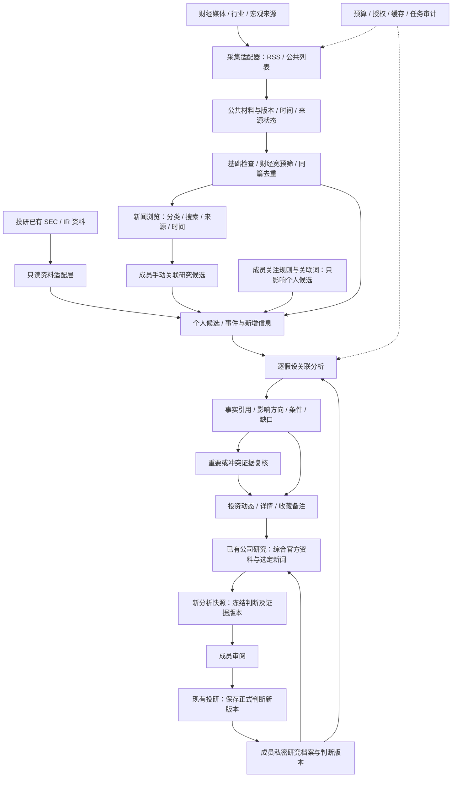

# 架构与技术选择

## v0.4 实现补充 · 2026-09-30

公司总览复用 ResearchDossier、既有综合分析快照与新闻候选，不另建判断模型。已有报告按冻结的 news_snapshots 分为投研分析和含新闻综合分析；新闻分析保留逐材料、逐假设记录。

NewsSource.config 保存有限字段映射，不执行脚本。网络请求继续使用 M4.1 公共 HTTP 防护；信源测试签名绑定管理员、来源、配置及更新时间，30 分钟有效。保存后暂停；定时循环按到期时间轮询，避免第九个及之后的来源长期不被处理。

MaterialRelation 是追加式、绑定材料版本的管理员复核记录，含 duplicate / followup / conflict / independent。同事件展示合并与证据重复分开；相似度建议不自动影响分析权重。确认重复或精确内容重复时解析到有效原材料，以该材料建立本人候选并复用其版本缓存；原材料失效后停止复用。撤销关系不删除既有分析，后续任务重新核对。

ThesisEvidence 增加 source_claim / author_opinion，explanation 明确为模型推断。提示词版本升级；旧结果保留，并显示旧版本未提取字段的提示。正式综合分析记录 evidence_scope；来源引文与个人判断仍冻结。

2026-09-30 补充：新闻浏览使用分类标签、日期时间线和来源卡片；主题目录通过相同授权新闻读取层筛选材料，计数与列表共享可见范围。主题定义包含稳定 ID、名称、分组、说明及材料映射；一份材料可属于多个主题，不复制材料、不绑定个人投资假设。Demo 使用人工固定映射，正式版在 W02/W03 中维护分类映射；页面读取不触发 AI。

版本 v0.3，2026-09-29。部署仍为同一家庭工作台；新闻浏览是内部入口，不新增独立财经站。

## 模块图

## 技术选型

| 部分 | 选择 | 原因 |
|---|---|---|
| 应用 | 现有 Django 内新增 investment_watch 模块 | 复用账号、证券、研究档案和部署；投资逻辑不塞回人物情报评分 |
| 页面 | Django 模板 + 少量原生 JS | 延续工作台交互和现有原型，不引入第二套前端运行时 |
| 存储 | 现有 PostgreSQL，新增表和迁移 | 同库清晰归属；通过服务层读写，不跨模块直接覆盖事实 |
| 定时处理 | Django management command + 现有 NAS 调度 | 采集独立进程、限时限量，网页只读；暂不加 Celery/Redis |
| AI | 复用工作台 Provider 接口及授权审计 | 先规则，再少量结构化分析；不把现有“公开元数据授权”视为允许发送个人假设 |
| 当前 Demo | 无依赖静态 HTML/CSS/JS | 在实际集成前验证流程，localStorage 明确只是演示 |
| CI | Python / Node 检查 + 隔离 PostgreSQL | 标准库与 Demo 检查保留；已增加 Django + PostgreSQL 集成和行锁并发测试 |

## 复用边界

- M4.1：复用 URL 规范化、HTTP 防护、来源记录、增量游标、证据摘录及运行审计的机制。现有采集会调用人物情报分类，需要先拆出“获取并保存材料”，再分发给投资流程，不能直接启动旧循环当作投资采集。
- 投研：复用 ResearchDossier / ResearchThesisRevision 和 SEC、IR 文档版本。官方资料经只读适配层引用，不重新抓取一套。
- AIHOT：移植适用的列表解析、事件/后续区别及发布更正思路。Python 与 TypeScript 不直接混接，不引入独立 AIHOT 数据库和服务。
- 精选订阅：独立保留，不自动注入投资新闻流。

## 已实现的数据职责

| 对象 | 关键内容 | 边界 |
|---|---|---|
| WatchRule | owner、dossier、别名、关联词、启停、version | 成员私密，不能回写公共源全局分类 |
| MaterialVersion | 来源引用、内容摘要/必要摘录、hash、四类时间、状态 | 只追加版本；使用现有 既有官方资料时冻结当次版本 |
| InvestmentEvent | 稳定身份、证据链、前后进展、合并关系 | 先确定性去重，语义合并待复核；跨来源同文不等于独立印证 |
| ResearchCandidate | owner、dossier、material_version、手动/规则、状态 | 与有效证据分开；手动关联不自动形成 ThesisEvidence，也不写入既有分析 |
| ThesisEvidence | owner、revision、假设键、材料版本、引用、方向、条件、方法 | 每条假设单独结论；候选默认 unknown，不伪造支持/削弱 |
| EvidenceReview | 成员、证据版本、审阅时间、修正 | 追加记录，原建议保留；不等同于修改正式判断 |
| MemberAnnotation | owner、稳定事件 ID、已读、收藏、备注 | 上游撤回保留，显示失效；合并通过别名追溯 |
| WatchRun | 规则/输入版本、来源状态、费用预留、结果 | 可审计、幂等；不能把失败或未检查写为“无变化” |

## 安全、一致性和成本

1. 权限在检索、计数、详情、导出、AI 输入前执行；仅档案 owner 可见，家庭管理员无旁路。公共材料只来自明确配置的公开来源，不把全部 SourceItem 都视为公开内容。
2. 缓存键含成员范围、判断版本、材料版本、规则和提示词版本。生成结果前后检查版本；期间已变更则保存历史结果并标记失效。
3. 每日/月费用采用 Decimal，调用前在数据库事务内预留；异常和结果未知仍占额度。无价格配置或无授权不得调用。模型费用限额不是总运行支出的保证。
4. 正式判断只走投研已有保存流程；证据方向是分析结果，不能自动改变判断。
5. 更正与撤回不改写旧快照；失效证据退出有效支持集合，收藏及备注保留。正式判断改版后旧关联待复核，不自动套用到新假设。
6. 人工确认事件合并；可追溯原事件身份。同源多入口只计一条证据链；后续材料不覆盖较早事实。
7. 正式上线前完成家庭数据回归、可验证备份和小范围启用；当前只读核对了线上版本，尚未发布。

## 公司研究的唯一归属

正式判断只由 investment_research 维护。investment_watch 读取授权档案与当前版本，提供候选和证据关联；不存在第二个判断编辑接口或私有副本。已有第 56 号等 AI 分析记录保持冻结；可在页面外围显示“分析后新增材料”及其范围，但不把它们包装成旧分析已经采用的依据。新分析通过投研已有生成入口创建新记录，并保存材料版本与纳入范围。

新闻浏览读取授权公共材料集合，不依赖 WatchRule；个人搜索、收藏、手动关联和备注仍按 owner 隔离。不能为开放新闻浏览而放宽其他资料的阅读权限。模型关闭或预算耗尽不阻塞基础新闻池。

AIHOT 的具体复用落点、取舍和测试要求见 [六环节映射](06-aihot-decisions.md)。
