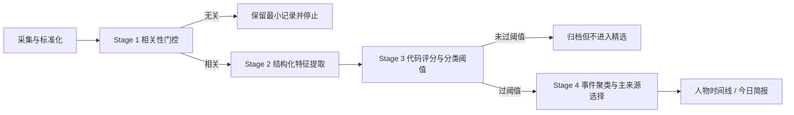

# 参考文章观点映射：AIHOT → 关键人物动态

参考材料：《这个封装了我 3 年自媒体经验的 AI 热点网站，今天向所有人免费开放。》
作者：卡兹克
评审状态：已阅读并完成设计映射
评审日期：2026-08-13

## 1. 文章方法概括

文章把信息工作拆为“获取信息—分析信息—基于信息决策”，其中 AIHOT 主要解决获取和筛选问题。
对本项目最有价值的不是某个具体模型或分数，而是以下工程经验：

1. 先精选信源，再处理信息；信源质量比采集数量更重要。
2. 官方官网、官方社交账号、个人/KOL/媒体的信噪比不同，应采用不同来源权重。
3. 大量采集结果必须先做领域相关性预筛，避免把昂贵模型用在明显无关信息上。
4. 不应让大模型同时负责打分、加权、分类和最终精选。
5. 大模型适合输出少量独立维度的特征分；最终权重、阈值和精选判定由代码完成。
6. 评分策略需要固定历史样本回放，避免规则越加越多、泛化反而变差。
7. 同一事件的多篇报道要聚类，只展示一个主事件，并折叠展示全部相关来源。
8. 事件簇主来源应优先选择官方、直接和权威来源。
9. 日报应复用已经完成的分类、翻译、摘要和评分结果，只做分桶和排序，不重复调用大模型。
10. 更长期的价值来自趋势、历史关联和热度变化，而非单条新闻数量。

## 2. 逐项设计映射

| 文章方法 | 本项目决定 | 处理方式 |
|---|---|---|
| 宁缺毋滥、一手优先 | 采纳 | 建立来源等级、启停和人工审核；首批对象必须先完成来源登记。 |
| T1 / T1.5 / T2 | 调整后采纳 | 使用 A/B/C/D 四级，额外记录来源载体；官方官网通常高于官方社交账号。 |
| 便宜模型预筛 | 采纳 | 增加 Stage 1 相关性门控，明显无关条目落库后停止后续昂贵处理。 |
| 强模型多维评分 | 采纳 | 强模型只输出版本化特征，不直接给最终精选结论。 |
| 代码计算权重和阈值 | 强制采纳 | 最终重要性、置信度、分类阈值由可测试的 `ScoringPolicy` 计算。 |
| 通过不断加长 Prompt 修正错误 | 不采纳 | 不自动把用户反馈拼成 Prompt；通过小而稳定的 Schema、代码规则和版本化评估迭代。 |
| 人类反馈 | 调整后采纳 | 保存“应该精选/不应该精选/聚类错误”等标签，用于离线评估，不直接在线自学习。 |
| 历史样本回放评估 | 采纳 | 建立冻结评估集；策略发布前比较精确率、召回率、重复率和高影响漏报。 |
| embedding 事件聚类 | 分阶段采纳 | 先用对象+时间窗+标题规则缩小候选，再用 embedding/语义判断；MVP 不强制独立向量库。 |
| 事件簇选择权威主条 | 采纳 | `IntelligenceEvent.primary_source_item` 按来源等级、直接性和完整性确定，可人工改选。 |
| 翻译、摘要并行 | 采纳 | 相关性门控后并行生成结构化分析与中文展示文本，失败互不覆盖原始证据。 |
| 日报不重复使用大模型 | 强制采纳 | 简报只查询已发布事件、按分类分桶和代码排序，保证幂等、快速、低成本。 |
| 趋势预测、历史关联、热度指数 | 延后 | 作为 M5 研究项；先积累高质量历史事件，再讨论预测和指数。 |

## 3. 对原技术方案的具体增补

### 3.1 四阶段处理漏斗



与文章不同，本项目把“事件聚类”放在正式发布前，并允许采集阶段先进行确定性去重。最终实现时可以
在样本测试后调整聚类与评分的先后顺序，但必须保持来源条目与事件分离。

### 3.2 模型只提供特征

建议首版由模型返回以下五类特征，具体量表在 M3 用样本评估后冻结：

1. `subject_relevance`：与目标人物/机构的直接相关程度。
2. `substantiveness`：是否包含实质动作、数据、承诺或新信息。
3. `novelty`：相对历史事件的新颖程度。
4. `potential_impact`：对行业、公司、政策或投资叙事的潜在影响。
5. `evidence_clarity`：主语、时间、数字和来源是否清晰可核查。

来源等级、事件类型、证据数量、发布时间衰减、是否转发、是否营销内容以及分类阈值均由代码计算，
不交给模型自由决定。

### 3.3 分类阈值不是一刀切

官方正式披露与个人转发的信噪比不同，不能使用统一阈值。`ScoringPolicy` 应按来源等级和事件类型配置
阈值，例如官方投资披露、完整采访、普通转发分别使用不同门槛。阈值是数据库或代码中的版本化策略，
不埋在 Prompt 中。

### 3.4 反馈与离线评估

新增设计对象：

- `SelectionFeedback`：用户对精选、遗漏、重复、主来源和变化标签的反馈。
- `ScoringPolicyVersion`：权重、阈值、适用时间和说明。
- `EvaluationCase`：冻结样本及人工期望结果。
- `EvaluationRun`：策略版本在固定样本上的指标与差异。

反馈只进入待评估数据集。任何评分策略升级必须在固定样本上回放并人工查看差异，不能根据少量点击
自动修改线上 Prompt 或阈值。

## 4. 针对“关键人物动态”的分类调整

文章的五个 AI 内容分类不适合直接照搬。本项目建议采用：

1. 发言与观点；
2. 采访与演讲；
3. 投资与持仓披露；
4. 产品、经营与资本配置动作；
5. 任职、组织与人物关系变化；
6. 政策与公共事务动作；
7. 其他重要动态。

同一个事件可以拥有一个主分类和多个主题标签，例如“AI 资本开支”“加密货币”“关税”“自动驾驶”。

## 5. 文章经验带来的优先级变化

相对原路线图，调整如下：

- M2 增加“相关性门控”和“主来源选择”。
- M2/M3 增加冻结评估集与评分策略版本，不等到上线后再补。
- M3 明确模型只输出特征，最终精选由代码完成。
- M4 明确日报不调用模型，只消费已处理事件。
- embedding 聚类仍保留，但先做规则候选缩小，避免过早引入新基础设施。

## 6. 不直接照搬的部分

- 不照搬文章的模型名称和版本；模型选择以本项目可用服务商、成本、Schema 遵循率和评估结果为准。
- 不照搬作者未公开的分数、Prompt 和阈值；本项目需要用自己的关注对象和样本标注建立规则。
- 不使用直接抓取受限 HTML 作为默认方案；优先正式 API、RSS、公开材料和人工链接。
- 不以自媒体“读者爱看”为核心目标；本项目更重视事实可靠、变化显著和与关注对象直接相关。
- 不在历史数据不足时开发趋势预测或热度指数，避免把噪声包装成预测。

## 7. 结论

文章最值得吸收的并不是“用某个大模型做新闻打分”，而是把编辑经验拆成可审计的软件流水线：

```text
精选信源 → 低成本门控 → 模型提取独立特征 → 代码计算分数和阈值
→ 事件聚类 → 权威主来源 → 复用结构化结果生成日报 → 用固定样本持续评估
```

这条路线与家庭工作台强调的幂等、审计、可降级和 NAS 简化运维相容，应作为关键人物动态 MVP 的
正式设计原则。

## 8. 本项目的轻量化调整

用户确认首期只重点跟踪少量人物及关联机构，因此不照搬案例的十个可独立调度步骤。项目采用五段式流水线，
把快速分类、评分特征提取、翻译和摘要合并为一次版本化结构化分析；随后由代码完成评分、阈值和展示分层。
管理员流水线页面只负责解释每一阶段的数量、失败和规则，不代表系统内部必须拆成十个服务。

详细策略见 [`lightweight-pipeline.md`](./lightweight-pipeline.md)。
