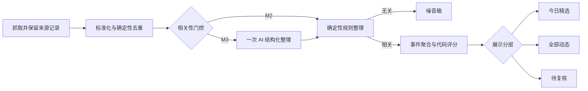

# 轻量情报流水线与评分策略

状态：Decision 1.0
更新时间：2026-08-13

## 1. 决策背景

本项目首期只重点跟踪少量人物及其关联机构。每日信息量预计为几十至数百条，不适合照搬面向全网热点、
海量信源的十步异步流水线。系统仍需保留完整原文、去重、过滤无关内容、事件聚合、可解释评分和失败审计，
但应优先保证简单、便宜和可维护。

## 2. 五段式流水线



### 阶段一：抓取并保留来源记录

- 保存平台条目 ID、规范链接、作者、发布时间、标题、必要短摘录和允许保存的元数据。
- 无关内容也保留最小记录，不因在线判断直接消失。
- 原文是证据底座，摘要、分类和评分都是可重新生成的派生数据。

### 阶段二：标准化与确定性去重

- 统一链接、时区、语言代码和空白字符。
- 优先按平台 ID 去重，其次按规范链接和内容指纹去重。
- 转发、重复发布和采集重跑不得制造重复来源条目。
- 这一步只使用代码，不调用大模型。

### 阶段三：结构化整理与相关性门控

M2 先用主题别名、来源主要主题和投资/科技关键词做确定性门控。规则只决定是否生成待复核候选，
不会把标题或简介改写成已经核实的事实；低相关条目仍保留在噪音箱。

M3 再对通过标准化的新条目调用一次文本模型，输出版本化 JSON：相关性、中文标题、事实摘要、
证据引用、主题、事件类型、新颖性、影响程度、投资参考价值、时效性、变化信号和提取置信度。

M1.5 只实现字段、规则接口和人工输入，不调用外部文本模型；M3 才接入模型。

### 阶段四：相关性门控、聚合与代码评分

- 相关性低的条目进入噪音箱，不进入普通信息流，但管理员可查看原因并纠正。
- 先用主题、时间窗、链接和标题规则缩小同一事件候选，再决定是否需要语义判断。
- 同一事件只生成一张事件卡，官方或直接来源优先作为主来源，其他来源折叠为证据。
- AI 只提供独立特征，最终分数和阈值由版本化代码计算。

### 阶段五：展示分层

| 层级 | 默认规则 | 展示位置 |
|---|---|---|
| 今日精选 | 重要性 ≥ 75 且置信度 ≥ 60 | 首页和未来简报 |
| 全部动态 | 相关但未达到精选阈值 | 全部动态 |
| 待复核 | 高重要性低置信度，或“转向”等高风险结论 | 管理员复核 |
| 噪音箱 | 相关性 < 30 或重要性 < 25 | 仅管理员可见 |

阈值是 `people-v1` 的初始策略，真实样本积累后必须通过固定样本回放再调整。

## 3. 重要性评分

```text
重要性 = 相关性×25% + 影响程度×25% + 新颖性×20%
       + 投资参考价值×15% + 时效性×15%
```

## 4. 置信度评分

```text
置信度 = 来源质量×40% + 证据完整度×30%
       + 交叉验证×20% + 提取确定度×10%
```

初始来源质量映射：A=95、B=80、C=65、D=40。官方来源的一条日常推文可以有很高置信度，
但其重要性仍应很低；两个分数不能互相替代。系统保存输入、权重、策略版本和计算结果。

## 5. 产品信息架构

- **今日精选**：只看高价值事件。
- **全部动态**：查看相关事件并按主题、类型、分层筛选。
- **信源管理**：管理抓取入口、等级、类别、健康状态和关联主题。
- **关注主题**：管理人物、机构、行业、技术、政策和证券；提供主题时间线。
- **流水线**：管理员查看各阶段数量、失败、噪音、待复核和处理成本。

“关注主题”和“信源”是多对多关系：一个 OpenAI 官网可以关联 OpenAI、生成式 AI、Agent 等多个主题；
一个人物也可以同时有 X、博客、YouTube、采访和监管披露等多个信源。

## 6. 当前实现边界

- M1 已有人工证据闭环。
- M1.5 实现主题/信源拆分、信源地图、流水线统计、确定性评分和展示分层。
- M2 已接入 RSS / Atom 与 YouTube 官方频道元数据、标准化、规则门控和幂等采集。
- M3 接入一次性 AI 结构化分析和历史变化判断。
- M4 生成简报和推送；简报复用已入库结果，不重复调用 AI。

## 7. 不做事项

- 不为少量信源引入 Celery、Redis、Kafka 或独立向量数据库。
- 不把十个内部动作做成十套异步服务。
- 不因无关判断删除原始条目。
- 不让大模型直接决定最终精选，也不在线自学习修改阈值。
- 不在未验证凭证、费用和 NAS 网络可达性前启用 X 或其他付费平台。
