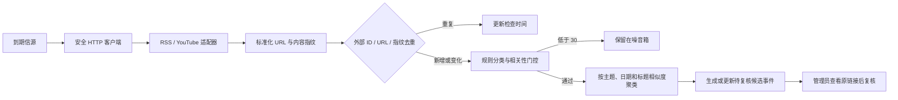

# M2 自动采集设计与运维

状态：本地实现完成，待真实来源与 NAS 验证
更新时间：2026-08-13

## 1. 本阶段范围

M2 只接入两类无需 API Key 的公开入口：

- RSS / Atom：读取标题、链接、作者、发布时间和订阅中提供的简介；
- YouTube 官方频道 Atom：读取视频 ID、标题、原链接、频道、发布时间和订阅中提供的简介。

本阶段不下载 YouTube 视频或音频，不请求字幕/转录，不抓公开网页正文，不调用文本 AI，也不接入
SEC 或 X。来源条目显示 `content_depth`，让用户明确当前判断依据是“仅标题”还是“标题与简介”。

## 2. 首批官方信源

| 信源 | 类型 | 主要主题 | 周期 | 默认状态 |
|---|---|---|---:|---|
| OpenAI 官方新闻 RSS | RSS | OpenAI、Sam Altman、AI 基础设施、AI Agent | 120 分钟 | 启用 |
| NVIDIA 官方新闻稿 RSS | RSS | NVIDIA、Jensen Huang、AI 基础设施 | 120 分钟 | 启用 |
| NVIDIA 官方博客 RSS | RSS | NVIDIA、Jensen Huang、AI 基础设施 | 120 分钟 | 启用 |
| OpenAI 官方 YouTube | YouTube Atom | OpenAI、Sam Altman、AI 基础设施、AI Agent | 180 分钟 | 停用 |
| NVIDIA 官方 YouTube | YouTube Atom | NVIDIA、Jensen Huang、AI 基础设施 | 180 分钟 | 停用 |
| ARK Invest 官方 YouTube | YouTube Atom | ARK Invest、Cathie Wood | 180 分钟 | 停用 |
| Ray Dalio 官方 YouTube | YouTube Atom | Ray Dalio | 240 分钟 | 停用 |

`seed_intelligence_sources` 只登记配置，不会隐式联网。YouTube 频道使用已核对的稳定 `UC...` ID，
页面昵称 URL 只供用户打开查看，采集使用官方频道 Atom 地址。

2026-08-13 办公电脑真实验证时，4 个官方频道页面和频道 ID 均核对正确，OpenAI 页面也明确声明
对应 RSS 链接，但这些 Atom 请求均返回 HTTP 404。为避免 DSM 任务持续部分失败，YouTube 种子信源
默认停用；适配器和固定样本测试继续保留，待端点恢复或用户决定配置 YouTube Data API 后再开启。

## 3. 数据流程



自动候选始终标记“尚未核查完整正文或视频内容”，复核状态为“待复核”。它不会仅凭标题/简介直接
变成已核实事实或自动发布给普通成员。

## 4. 幂等、游标与失败策略

- 去重顺序：`(source, external_id)` → 规范 URL → 标题/链接/简介 SHA-256 指纹；
- 支持 ETag 和 Last-Modified 条件请求；成功后保存最近外部 ID 与发布时间；
- HTTP 超时 12 秒，每个请求最多 2 次尝试，仅对网络错误、429 和 5xx 有限重试；
- 单次响应最大 2 MB，每个信源每次最多 100 条；
- 单条处理失败不撤销同一信源已成功条目，单一信源失败不阻断其他信源；
- 全部成功（包括没有到期信源）返回退出码 0；部分成功或全部失败返回非零，但成功数据仍保留；
- 连续失败按“最近尝试时间”计算下次到期，避免失败后被每次任务立即重打。

## 5. 安全边界

- 只允许 HTTP/HTTPS 标准端口，拒绝 URL 用户名/密码；
- 拒绝 localhost、`.local`、`.internal`、私有/回环/保留 IP；每次重定向和最终地址再次校验；
- 错误摘要不记录查询参数、响应正文、请求头或密钥；未知异常只把堆栈写入服务日志；
- XML 拒绝 DTD/实体声明，避免外部实体读取；
- 页面 GET 只读数据库，绝不隐式联网或启动批处理；
- M2 不需要新增 API Key，也没有新增 Python 依赖。

若办公电脑的全局代理使用 Fake-IP 模式，公网域名可能被解析到专用基准测试网段 `198.18.0.0/15`。
安全客户端默认仍拒绝该网段；仅在确认是本机代理行为后，可为该环境设置
`INTELLIGENCE_ALLOW_PROXY_FAKE_IP=True`。这个开关只放行“域名经 DNS 得到的 Fake-IP”，直接填写
`198.18.x.x` 的信源 URL 仍会拒绝。NAS 和普通网络应保持默认 `False`。

## 6. 本地与 NAS 命令

首次登记配置：

```bash
python manage.py seed_key_people
python manage.py seed_intelligence_sources --dry-run
python manage.py seed_intelligence_sources
```

采集到期信源：

```bash
python manage.py collect_intelligence_sources
```

只对指定信源做小流量验证：

```bash
python manage.py collect_intelligence_sources --source-id <ID> --force --max-items 10
```

NAS 建议由 DSM Task Scheduler 每 30–60 分钟调用一次默认命令；命令内部会按每个信源的周期跳过
未到期来源。网页“立即采集”是管理员诊断入口，不能替代正式 DSM 任务。

未经用户明确授权，本分支不会连接 NAS、修改生产数据库或创建 DSM 任务。正式部署前必须先备份并
验证数据库，再执行迁移和小流量采集。

## 7. 验收证据与已知限制

固定样本测试覆盖 RSS 2.0、RSS 1.0/RDF、Atom、YouTube Atom、危险 XML、内网 URL、三次重复采集、
噪音门控、单一来源失败和网页权限。OpenAI 官方 RSS 已真实采集 10 条；YouTube 真实 Atom 未通过，
NAS 也仍需单独验证。

当前规则适合少量重点对象的首轮筛选，但可能出现：标题太短而进入噪音、同一事件标题差异过大而未合并、
或仅凭关键词进入待复核。先保留这些可追溯误差并收集真实样本，M3 再评估文本 AI 和语义聚类，避免
在数据量很小时过度设计。
