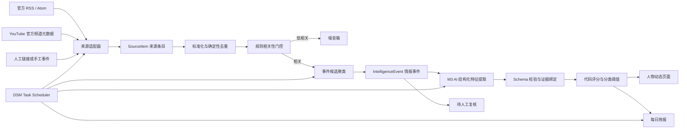
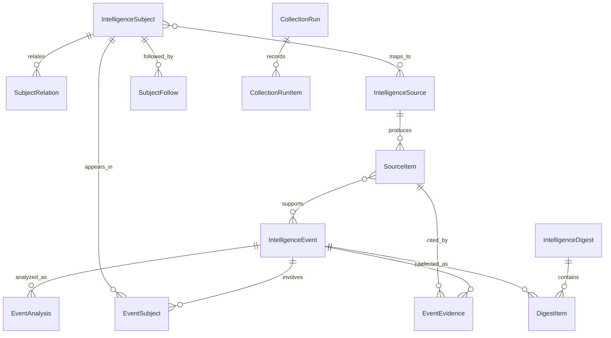

# 关键人物动态模块：技术设计方案（HLD / TDD）

状态：Draft 0.1
设计基线：家庭工作台 `origin/master` @ `38d9002`

## 1. 现有系统基线

家庭工作台当前使用：

- Django 5 + 服务端模板 + 少量原生 JavaScript/CSS。
- PostgreSQL 16 作为 NAS 生产数据库，本地可使用 SQLite。
- Docker Compose + Gunicorn + WhiteNoise 部署。
- `FamilyMember`、`ActiveHouseholdMemberMiddleware` 提供家庭身份和只读角色控制。
- `AiProvider`、`AiAnalysisRequest`、`AiAnalysisResult` 已提供 AI 配置与审计基础，但通用文本分析服务尚未实现。
- `portfolio.SecurityNews` 是证券维度的简单新闻缓存，尚无采集、事件聚类或证据模型。
- 正式定时任务使用 Django 管理命令与 DSM Task Scheduler，不引入 Celery/Redis。

## 2. 架构决策摘要

### ADR-001：建立通用 `intelligence` 应用

第一期产品只展示关键人物动态，但代码采用通用 `intelligence` Django app。原因：人物名单中同时存在
伯克希尔等机构，未来个股行业新闻和 AI 前沿也需要复用来源、事件、证据、去重和简报能力。

通用底座不代表扩大 MVP；第一期只实现 `people` 频道和必要字段。

### ADR-002：区分“来源条目”和“情报事件”

来源条目是外部事实记录；情报事件是多来源聚合后的产品对象。二者分离后才能：

- 保留原始证据；
- 合并重复报道；
- 新增来源时更新事件，而不是再次推送；
- 重跑 AI 而不破坏采集事实。

### ADR-003：定时命令而非异步任务平台

MVP 使用可组合、可重跑的 Django 管理命令，由 DSM 调度。每个命令写入运行记录并以退出码报告结果。
在确实出现队列积压、并发或实时性需求前，不增加常驻基础设施。

### ADR-004：保留 `SecurityNews`，暂不迁移

第一期不修改或删除 `portfolio.SecurityNews`。未来个股频道通过 `EventSecurity` 关联 `Security`，验证稳定后
再决定是否迁移历史 `SecurityNews`。这样可以降低本阶段对投资组合模块的回归风险。

### ADR-005：采用五段式轻量流水线

首期信源少、吞吐量低，采用“抓取保存 → 标准化去重 → 结构化整理/门控 → 代码评分聚合 → 分层展示”。
M2 使用确定性规则完成第三步，M3 才接入一次文本 AI。
不照搬十步异步架构，不引入消息队列。完整决策见 `lightweight-pipeline.md`。

### ADR-006：关注主题与信源分离

`IntelligenceSubject` 在用户界面称为“关注主题”，类型扩展到人物、机构、行业、技术、政策和证券。
`IntelligenceSource` 是独立抓取入口，与主题为多对多关系；保留可选主要主题用于默认归属和人工录入。

## 3. 组件架构



推荐目录结构：

```text
app/intelligence/
├── admin.py
├── apps.py
├── forms.py
├── models.py
├── urls.py
├── views.py
├── selectors.py
├── services/
│   ├── collection.py
│   ├── normalization.py
│   ├── deduplication.py
│   ├── clustering.py
│   ├── ai_enrichment.py
│   ├── scoring.py
│   └── digest.py
├── sources/
│   ├── base.py
│   ├── rss.py
│   ├── youtube.py
│   ├── sec_edgar.py
│   ├── x_api.py
│   └── manual.py
├── management/commands/
│   ├── collect_intelligence_sources.py
│   ├── process_intelligence_items.py
│   ├── build_people_digest.py
│   └── seed_key_people.py
└── tests/
```

## 4. 数据模型

### 4.1 模型概览



### 4.2 核心表

#### `IntelligenceSubject`

关注主题主表。代码名称为兼容 M1 暂不重命名。

| 字段 | 说明 |
|---|---|
| `subject_type` | `person` / `organization` / `industry` / `technology` / `policy` / `security` / `topic` |
| `canonical_name` | 规范名称 |
| `display_name` | 中文展示名称 |
| `slug` | 稳定 URL 标识 |
| `aliases` | 别名、英文名、旧名称，JSON 数组 |
| `category` | 科技领袖、投资人、政策人物、机构等 |
| `profile_summary` | 人工维护的简短背景 |
| `avatar_url` | 可选头像地址，不复制未经授权的图片 |
| `importance_level` | 1–5，作为排序先验而非事实判断 |
| `is_active` | 是否启用 |
| `extra_data` | 扩展字段 |

`slug` 创建后不应随显示名称改变。人物与机构使用同一表，避免为伯克希尔等对象建立伪人物记录。

#### `SubjectRelation`

记录对象关系，例如任职、创办、投资、继任、关联机构。包含 `from_subject`、`to_subject`、
`relation_type`、`valid_from`、`valid_to` 和证据说明。

#### `IntelligenceSource`

信源不再强制从属于单个人物。新增主题多对多、信源类别、最近尝试时间和脱敏错误摘要；
健康状态由启用状态、连续失败次数和最近成功时间确定。

| 字段 | 说明 |
|---|---|
| `subject` | 可选主要关联主题，兼容人工录入 |
| `topics` | 多对多关联主题 |
| `source_group` | 官网、人物博客、机构、媒体、社交、监管或其他 |
| `source_type` | RSS、官网、X、YouTube、SEC、媒体、人工 |
| `adapter_key` | 适配器稳定代码 |
| `name` | 展示名称 |
| `url` / `external_id` | 入口地址或平台 ID |
| `source_tier` | A 官方、B 直接采访、C 可信二手、D 发现线索 |
| `poll_interval_minutes` | 建议采集间隔 |
| `cursor` | 增量游标/最近外部 ID，JSON |
| `last_success_at` | 最近成功时间 |
| `consecutive_failures` | 连续失败次数 |
| `is_active` | 是否启用 |
| `extra_data` | 仅保存非敏感配置；密钥只保存环境变量名 |

#### `SourceItem`

外部条目的标准化事实记录。

| 字段 | 说明 |
|---|---|
| `source` | 信息源 |
| `external_id` | 平台条目 ID |
| `canonical_url` | 规范化原文链接 |
| `title` | 原始标题 |
| `author_name` | 发布者 |
| `published_at` | 原始发布时间 |
| `fetched_at` | 采集时间 |
| `language` | 原文语言 |
| `excerpt` | 合规的短摘录或 API 返回摘要 |
| `content_hash` | 标准化后内容指纹 |
| `raw_metadata` | 非敏感、最小化的来源元数据 |
| `processing_status` | 待处理、已聚类、已分析、失败、忽略 |

约束建议：

- `(source, external_id)` 在外部 ID 非空时唯一。
- `canonical_url` 非空时建立索引，并在服务层去重。
- 不默认保存完整版权正文或平台完整响应。

#### `IntelligenceEvent`

| 字段 | 说明 |
|---|---|
| `channel` | MVP 固定为 `people` |
| `event_type` | 发言、采访、投资、持仓披露、经营动作、政策动作、任职变化等 |
| `title` | 中文事件标题 |
| `occurred_at` | 事件发生时间，未知时使用最早可靠发布时间并标记精度 |
| `summary` | 当前正式摘要 |
| `why_it_matters` | 可核查的影响说明 |
| `importance_score` | 0–100 |
| `confidence_score` | 0–100 |
| `change_type` | 新动向、延续、增强、转向、无法判断 |
| `review_status` | 自动发布、待复核、已复核、忽略 |
| `cluster_key` | 事件聚类稳定标识 |
| `first_seen_at` / `last_seen_at` | 首次与最近发现时间 |

#### `EventSubject`

多对多关联，记录对象在事件中的角色：`speaker`、`subject`、`investor`、`executive`、
`mentioned`、`affected_organization` 等，并保存关联置信度。

#### `EventEvidence`

连接事件和来源条目，记录证据类型、短摘录、支持的 claim ID、来源质量和是否为主证据。

#### `EventAnalysis`

AI 分析版本表，而不是直接覆盖唯一结果。

| 字段 | 说明 |
|---|---|
| `event` | 被分析事件 |
| `provider` | 复用 `AiProvider` |
| `model_name` | 实际模型 |
| `prompt_version` / `schema_version` | 处理版本 |
| `result_json` | 通过 Schema 校验的结果 |
| `status` / `error_message` | 执行状态 |
| `tokens_used` / `cost_estimate` | 可选成本审计 |
| `created_at` | 处理时间 |

事件表指向一个 `current_analysis` 或通过服务层选择最新成功版本。重跑不会丢失历史结果。

#### 评分反馈与评估

- `ScoringPolicyVersion`：版本化保存来源权重、事件类型权重、各分类阈值和生效时间。
- `SelectionFeedback`：记录误选、漏选、重复聚类、主来源错误及变化标签错误，包含操作者。
- `EvaluationCase`：冻结的历史样本与人工期望结果。
- `EvaluationRun`：记录策略版本在评估集上的精确率、召回率、重复率、高影响漏报及差异明细。

反馈不会直接触发在线自学习或自动扩写 Prompt，只用于离线评估和人工批准后的策略升级。

#### 用户与简报表

- `SubjectFollow`：家庭、成员、关注对象、启用、静音、优先级。
- `EventUserState`：成员、事件、已读时间、收藏时间、静音。
- `IntelligenceDigest`：家庭、日期、类型、状态、摘要、生成版本，日期与类型唯一。
- `DigestItem`：简报、事件、排序、入选理由。

#### 运行记录

- `CollectionRun`：命令参数、开始/结束时间、状态、发现/新增/更新/失败数量、错误摘要。
- `CollectionRunItem`：按来源记录状态和错误，便于网页诊断。
- AI 批处理可复用 `AiAnalysisRequest` 审计，也可在 `EventAnalysis` 上增加批次 ID；实现前通过原型决定。

## 5. 采集适配器协议

所有适配器实现统一接口：

```python
class SourceAdapter:
    adapter_key: str

    def validate_config(self, source) -> list[str]: ...
    def fetch(self, source, *, since=None, limit=100) -> FetchResult: ...
    def normalize(self, external_item, source) -> NormalizedSourceItem: ...
```

`FetchResult` 包含条目、下一游标、请求元数据和非敏感错误。网络策略统一由基础客户端处理：超时、
重试上限、退避、限速、User-Agent 和最大响应体。

首批适配器优先级：

1. `manual`：人工链接/事件，先打通完整数据链路。
2. `rss`：官方博客、公司新闻室、播客或媒体 RSS。
3. `youtube`：M2 使用无需 API Key 的官方 Atom 频道订阅，仅保存元数据。
4. `sec_edgar`：公开监管披露，顺延后续阶段。
5. `x_api`：取得正式 API 凭证和成本确认后启用。

## 6. 标准化、去重与事件聚类

### 6.1 确定性去重

按以下顺序处理：

1. `(source_id, external_id)` 精确匹配。
2. 规范化 URL 匹配：去除追踪参数、统一主机名和末尾斜杠。
3. `content_hash` 匹配：对标题、发布者、时间桶和摘录规范化后计算 SHA-256。

### 6.2 事件候选聚类

MVP 采用可解释的两阶段策略：

1. 规则生成候选：共享主要对象、发布时间相差不超过配置窗口、标题关键词重合。
2. 对候选计算相似度或调用低成本 AI 做“是否同一事件”的结构化判断。

低于阈值创建新事件，高于阈值挂到已有事件，中间区间进入待复核。禁止仅凭同一人物自动合并。

### 6.3 幂等要求

- 同一来源重复采集不增加条目。
- 同一条目重复处理不增加事件关联。
- 同一日期重复生成简报更新原简报，不增加第二份正式简报。
- AI 重跑新增分析版本，但只有一个被选为当前正式结果。
- 每日简报只消费已发布事件并进行代码分桶、排序，不重复调用 AI。

## 7. AI 处理设计

### 7.1 处理步骤

1. 使用低成本模型进行相关性门控；明显无关条目保留最小记录并停止昂贵处理。
2. 只将通过门控事件的最小必要标题、摘录、元数据和历史对比摘要发送给分析模型。
3. 要求输出 JSON，包含 `claims`、`opinions`、`numbers`、`event_type`、`importance_reason`、
   `change_type`、`uncertainties` 和 `evidence_refs`。
4. 模型输出人物相关度、实质性、新颖度、潜在影响和证据清晰度等独立特征，不输出最终精选决定。
5. 服务端进行 JSON Schema、枚举、时间、数字和证据引用校验。
6. 代码根据 `ScoringPolicyVersion` 计算最终分数和按分类阈值的精选结果。
7. 不通过校验时有限重试；仍失败则保留原始条目并标记分析失败。
8. 高重要性且低置信度、观点转向或证据冲突的事件进入人工复核。

### 7.2 与现有 AI 模块的关系

- 继续使用 `AiProvider` 管理服务商名称、地址、模型和环境变量名。
- 扩展 `provider_type` 的业务约定，至少区分 `vision` 与 `text`，不破坏现有 IPO 图片识别。
- 在 `intelligence.services.ai_enrichment` 建立文本分析网关，避免将人物情报逻辑写进
  `ipo.services` 或通用视图。
- API Key 通过 `extra_data.api_key_env_var` 指向环境变量；不得返回到浏览器。

## 8. 重要性与置信度

初始代码策略为 `people-v1`：

- 重要性 = 相关性 25% + 影响程度 25% + 新颖性 20% + 投资参考价值 15% + 时效性 15%。
- 置信度 = 来源质量 40% + 证据完整度 30% + 交叉验证 20% + 提取确定度 10%。
- 精选：重要性 ≥ 75 且置信度 ≥ 60。
- 待复核：高重要性低置信度，或未经人工确认的“转向”。
- 噪音：相关性 < 30 或重要性 < 25。

事件保存特征、权重、阈值、策略版本和最终分层。M1.5 由人工输入特征验证规则，M3 才由文本模型提供特征。

MVP 采用可解释的规则分数，AI 只提供特征，不直接决定最终排序或是否精选。不同来源等级和事件类型
可以使用不同阈值，避免把官方正式披露与普通转发放在同一门槛下比较。

重要性特征建议：

- 对象预设重要性；
- 事件类型权重（投资披露、重大政策、经营决策高于日常转发）；
- 是否出现明确数字、承诺、时间表或资金动作；
- 新颖度和观点变化强度；
- 是否关联已关注机构或未来的持仓标的。

置信度特征建议：

- 来源等级；
- 是否为本人/机构直接发布；
- 独立来源数量；
- 时间和主语是否明确；
- 来源之间是否冲突；
- AI 输出是否完整绑定证据。

分数必须同时展示解释标签，例如“本人直接发言 + 两个独立来源”，不能只显示一个神秘数字。

## 9. 页面与查询边界

视图只查询已落库数据，不在 GET 请求中调用外部来源或 AI：

| URL 建议 | 页面 |
|---|---|
| `/intelligence/people/` | 今日简报和最新事件 |
| `/intelligence/people/events/` | 全部事件与筛选 |
| `/intelligence/people/events/<pk>/` | 事件详情与证据 |
| `/intelligence/sources/` | 信源地图与健康状态 |
| `/intelligence/people/subjects/` | 关注主题列表 |
| `/intelligence/pipeline/` | 五段流水线统计与规则说明 |
| `/intelligence/people/subjects/<slug>/` | 对象时间线 |
| `/intelligence/people/bookmarks/` | 收藏 |
| `/intelligence/operations/` | 管理员运行状态 |

复杂查询放在 `selectors.py`，写入流程放在 `services/`；视图不直接承担采集、聚类和 AI 业务逻辑。

## 10. 管理命令与调度

建议命令：

```text
python manage.py collect_intelligence_sources [--source-id ID] [--force] [--max-items N]
python manage.py process_intelligence_items [--limit N] [--retry-failed]
python manage.py build_people_digest [--date YYYY-MM-DD] [--force]
python manage.py seed_key_people [--dry-run]
python manage.py seed_intelligence_sources [--dry-run]
```

建议的 NAS 调度起点，正式时间在来源验证后确定：

- 每 30–60 分钟：采集启用来源。
- 采集后：处理新增来源条目和 AI 分析。
- 每天固定时间：生成每日简报。
- 每天一次：检查连续失败、积压和长期无更新来源。

命令加锁避免并发运行；锁超时和失败均写运行记录并返回非零状态。

## 11. 权限与审计

- 所有业务页面继续经过 `ActiveHouseholdMemberMiddleware`。
- `viewer` 仅可 GET。
- 来源启停、人工合并/拆分事件、重新分析和运行命令网页入口仅限管理员。
- 人工操作记录 `created_by`、`updated_by` 或单独审计记录。
- 外部来源、AI 和人工编辑必须在页面上可区分。

## 12. 安全与合规

- 密钥只存 `.env`；数据库保存环境变量名而不是密钥值。
- 日志对 URL 查询参数、令牌、响应头和用户数据脱敏。
- 限制响应体大小、重定向次数、请求超时，防止异常来源拖垮定时任务。
- 不允许用户提交内网地址、`localhost` 或私有 IP 作为自动抓取 URL，降低 SSRF 风险。
- 不复制完整付费文章；保存原文链接、元数据和必要短证据。
- 对平台 API 遵循访问条款、限额和删除/保留规则。

## 13. 可观测性与故障处理

管理员运行状态至少展示：

- 最近成功/失败时间；
- 每个来源连续失败次数；
- 新增、更新、忽略、聚类、分析失败数量；
- 待处理积压；
- 最近错误的脱敏摘要；
- 当前模型和提示词版本。

失败策略：

- 网络瞬时错误有限重试；
- 401/403 配置错误不持续重试，直接告警；
- 429 读取服务端退避信息并延后；
- Schema 失败有限重试后转人工复核；
- 单来源失败不回滚其他来源的成功结果。

## 14. 测试策略

### 单元测试

- URL 规范化、内容指纹和确定性去重。
- 每个适配器的样本响应解析，使用固定 fixture，不依赖测试时联网。
- AI JSON Schema 校验、证据引用和失败降级。
- 重要性、置信度和变化标签规则。

### 集成测试

- 采集命令幂等性和运行记录。
- 来源条目到事件、证据、分析的完整链路。
- 每日简报重复运行不重复创建。
- `admin/member/viewer` 权限和不同家庭数据隔离兼容性。

### 回归与部署测试

- 全项目测试、`manage.py check`、迁移检查、`git diff --check`。
- 空数据库迁移和已有数据库迁移。
- NAS 备份后部署；核对现有账本、IPO、投资组合和笔记表计数不变。
- 定时命令真实小流量验证后再扩大来源数量。

## 15. 容量假设

MVP 假设：关注对象不超过 50 个、来源不超过 200 个、每日新增来源条目不超过 5,000 条。
PostgreSQL 普通索引与分页足够，无需向量数据库。若语义聚类质量需要向量能力，先评估 PostgreSQL
扩展或离线相似度，不提前引入独立向量服务。
